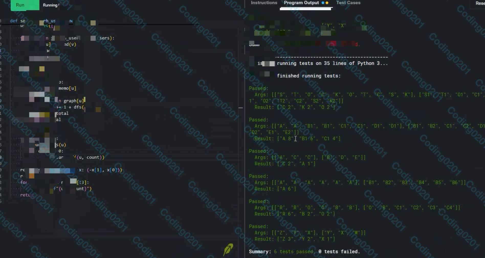
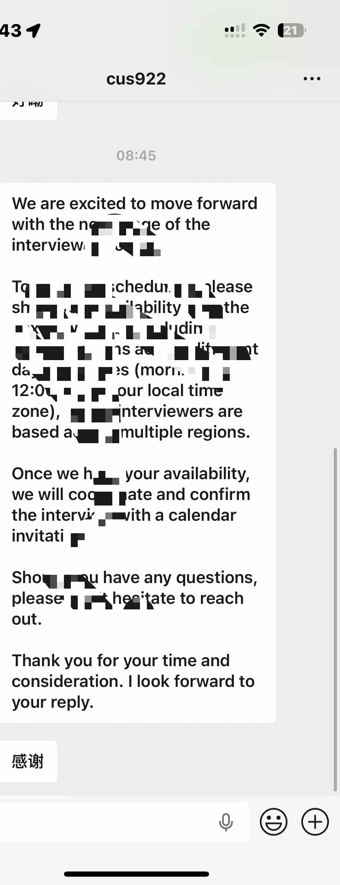
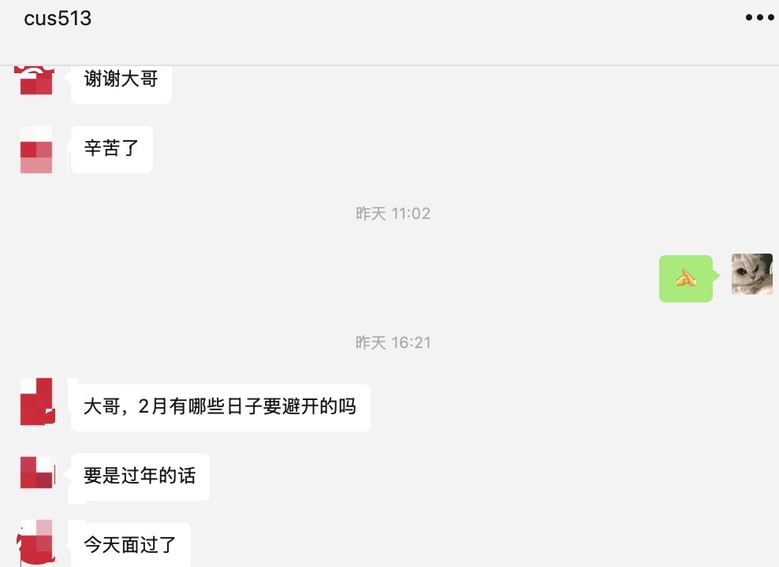

# OA VO Service — 专业OA代做 | VO辅助 | 面试辅助

> 🌐 官网：[oavoservice.com](https://oavoservice.com)

---

## OA代做 | Hackerrank代考 | CodeSignal满分 | VO辅助

OA VO Service 专注提供高质量的 OA 代做与代考服务。我们精通 Hackerrank、CodeSignal、Codility 等主流平台，拥有海量题库与实战经验。无论是 Amazon OA、Google OA 还是各类大厂笔试，我们都能助您满分通过。同时提供 VO 面试实时辅助，让您面试无忧。

| 100+ | 80%+ | 5年+ |
|:---:|:---:|:---:|
| **成功入职** | **面试通过率** | **实战经验** |

---

## 团队介绍

我们是一支长期深耕面试与实战训练的导师团队。学长北京大学 CS 本硕，ACM 银牌获得者，目前专注于面试辅导与求职规划，累计帮助 **100+ 学员**斩获 Amazon、Google、Citadel、TikTok 等大厂 offer。

团队导师均来自一线大厂的 **Senior 工程师和面试官**，覆盖后端、前端、移动、数据与系统方向，辅助体系成熟可靠，真正做到与大厂标准接轨。我们与您直接沟通，简历包装、面试代面、代码代写、答疑咨询、VO 助攻、面试辅助、OA/VO 辅助都是亲力亲为。

---

## 创始人寄语

大家好，我是 OA VO Service 的创始人 **Cat**。

在这些年深耕面试辅导的过程中，我们见证了许多来自名校名企的候选人被淘汰，也帮助了无数 CMU、斯坦福、清北的优秀学子斩获理想 Offer。这让我们深刻认识到：在 CS 领域，真正决定结果的不是一纸文凭，而是**天赋与高强度训练的结合**。

OA VO Service 拥有严苛的内部标准——我们对面试的理解与造诣已超越多数面试官，不仅懂技术，更懂如何帮助候选人赢下 Offer；我们依靠口碑驱动服务，全网接近 **100% 好评率**，不需要别的来证明价值。把你的 OA / VO 交给我们，给我们一次机会，我们会用专业与投入，真正改变你的求职命运。

---

## 业务范围 & 服务保障

### 业务范围

面试辅助、OA 代考、VO 辅助、代面试、面试代面服务、远程面试辅助；通过语音转达、音频转接等技术，助力您拿梦想 OFFER；一亩三分地推荐服务，编程代写，OA 辅助，Hackerrank 代考，VO 代面试，面试 / VO 助攻辅助。

覆盖 Facebook、LinkedIn、Amazon、Google、Microsoft、腾讯、字节跳动、美团、百度等国内外大厂的面试辅导、咨询与内推帮助。

### 服务保障

- ✅ **代码独家定制，绝不重复使用**
- ✅ **严格保密协议，信息安全无忧**
- ✅ **质量层层把关，满意度保证**

---

## 覆盖公司与OA平台

**大厂OA代做**：Amazon OA、Google OA、Meta OA、Microsoft OA、Apple OA、Stripe OA、TikTok OA、Uber OA、LinkedIn OA、Netflix OA、Airbnb OA、Coinbase OA、Robinhood OA、Citadel OA、Two Sigma OA、Jane Street OA、Databricks OA、Snowflake OA、Palantir OA、Oracle OA、Salesforce OA、Adobe OA、VMware OA、Nvidia OA、Intel OA、Qualcomm OA、Tesla OA、SpaceX OA

**OA平台代考**：HackerRank 代考、CodeSignal 代考、Codility 代考、Karat 面试辅助、HireVue 辅助、Coderpad 代做、LeetCode 评测、AmCat 测试、Pymetrics 测试

**VO面试辅助**：电话面试辅助、视频面试辅助、远程面试实时辅助、系统设计面试辅助、行为面试 BQ 辅助、技术面试代面

---

## 常见问题 FAQ

### 什么是OA代做？OA代考服务如何进行？

OA 代做是指专业团队帮助您完成在线编程测试（Online Assessment）。我们提供 Amazon OA 代做、Google OA 代考、Meta OA 代写等服务。通过屏幕共享或远程协助，我们的工程师实时帮您解答 HackerRank、CodeSignal、Codility 等平台的算法题目，确保满分通过。

### VO辅助是什么？如何进行远程面试辅助？

VO 辅助（Virtual Onsite 辅助）是指在视频面试过程中，我们的资深工程师通过音频或文字实时为您提供答案提示和思路引导。适用于各大厂的技术面试、系统设计面试、行为面试 BQ 等环节，帮助您从容应对面试官提问。

### 代面试服务安全吗？会被发现吗？

我们采用成熟的技术方案和丰富的实战经验，确保面试辅助过程安全隐蔽。代码独家定制、严格保密协议、多年零事故记录。我们服务过数百位候选人，成功入职 Amazon、Google、Meta、Microsoft 等大厂。

### 你们支持哪些公司的OA和面试？

我们覆盖北美、国内所有主流科技公司：Amazon、Google、Meta、Microsoft、Apple、Stripe、TikTok、Uber、LinkedIn、Netflix、Airbnb、Coinbase、字节跳动、腾讯、阿里巴巴、百度、美团等。无论是 New Grad 还是 Intern 岗位，SDE、MLE、数据工程师等职位的 OA 和面试我们都能辅助。

### 如何联系你们获取OA代做或VO辅助服务？

您可以通过微信（**Coding0201**）、Telegram（**@oavocat666888**）、邮箱（**catcstech@gmail.com**）联系我们。请注明面试公司、时间、岗位等信息，我们会尽快为您评估并提供报价。

---

## 真实案例展示

**100+ 成功案例，真实反馈见证我们的专业实力。**

我们提供 OA 通过案例、VO 通过案例及客户真实评价截图，所有反馈均来自真实服务记录，欢迎访问官网查看详情。

| | | |
|:---:|:---:|:---:|
|  |  |  |
|  |  |  |
|  |  |  |

---

## 联系我们

| 渠道 | 信息 |
|------|------|
| **Email** | catcstech@gmail.com |
| **Phone** | +86 17863968105 |
| **微信** | Coding0201 |
| **Telegram** | @oavocat666888 |

> 为尽快联系和评估，请在添加联系方式后注明面试 / 作业的具体要求、时间节点与平台信息。

---

Copyright © 2020–2026 OA VO Service. All Rights Reserved.
